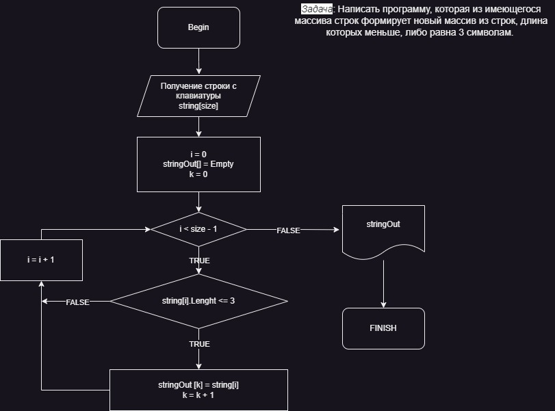

# Это домашнее задание к Основному блоку

*Задача: Написать программу, которая из имеющегося массива строк формирует новый массив из строк, длина которых меньше, либо равна 3 символам. Первоначальный массив можно ввести с клавиатуры, либо задать на старте выполнения алгоритма. При решении не рекомендуется пользоваться коллекциями, лучше обойтись исключительно массивами.*

## Код решения домашнего задания не использует списки

### В папке с ДЗ лежит блок-схема алгоритма

